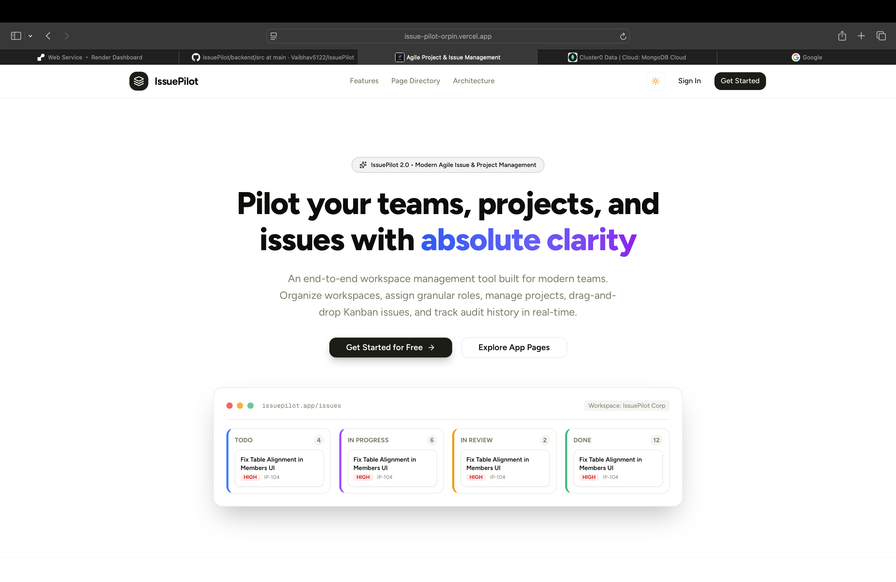
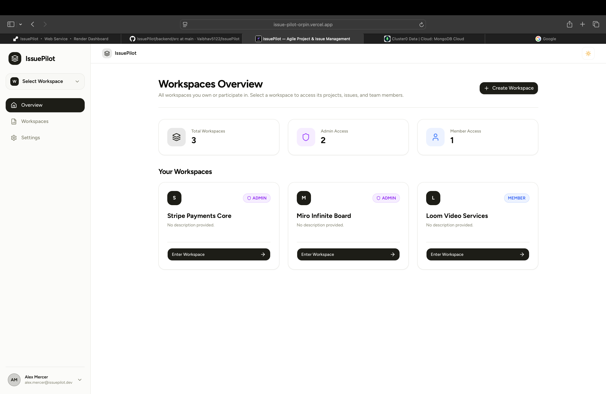
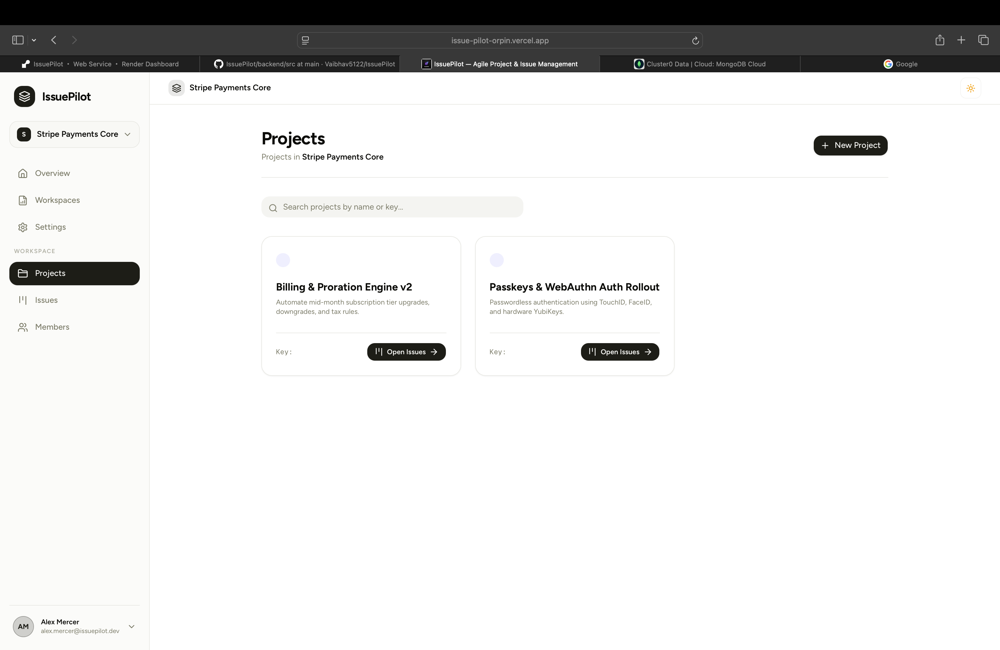
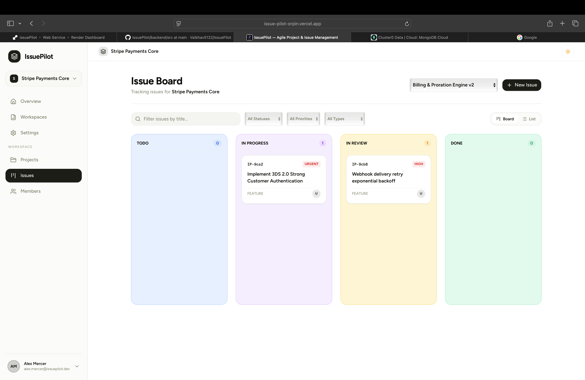
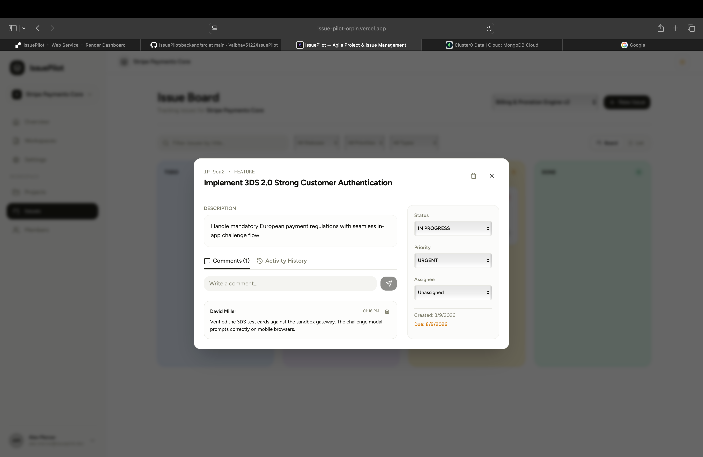
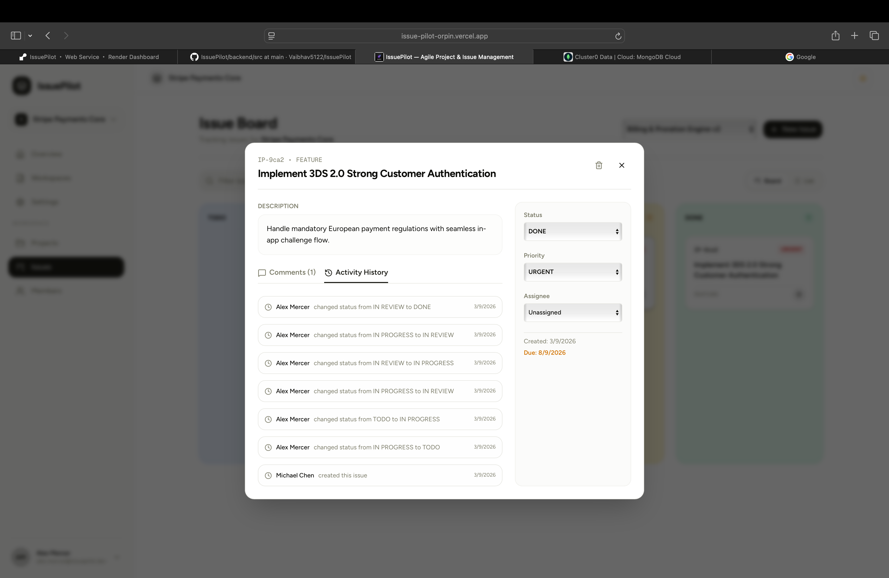
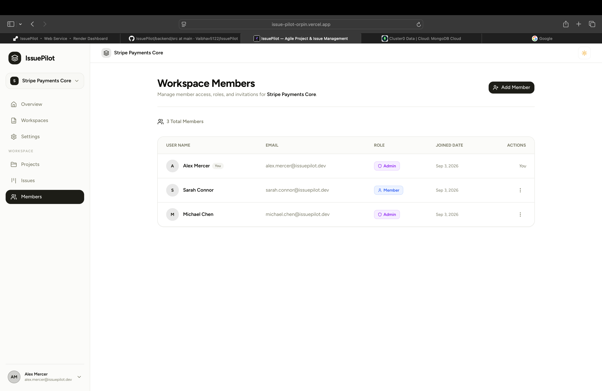
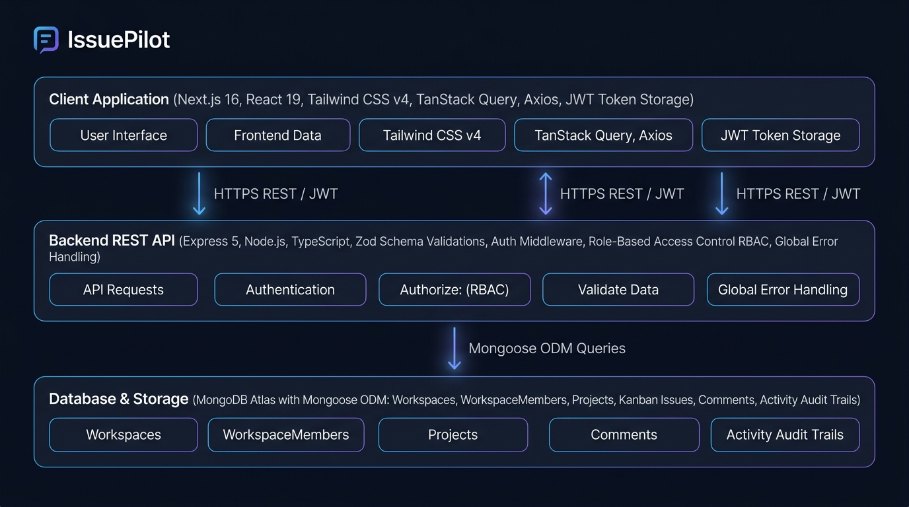

# ✈️ IssuePilot

**IssuePilot** is a full-stack project management, issue tracking, and team collaboration platform. Designed for modern engineering and product teams with multi-workspace support, role-based access control, interactive Kanban boards, activity audit trails, and issue discussions.

---

## 📸 Visual Showcase & Tour

> [!TIP]
> **Quick Test Login**: Try the live deployment with email `alex.mercer@issuepilot.dev` and password `Password@123`.

| 🚀 Modern Landing Page | 🏢 Multi-Tenant Workspaces Overview |
| :---: | :---: |
|  |  |

| 📁 Project Directory & Progress | 📋 Interactive Kanban Board & Swimlanes |
| :---: | :---: |
|  |  |

| 🔍 Detailed Issue Drawer & Discussion | ⚡ Chronological Activity Audit Trail |
| :---: | :---: |
|  |  |

| 👥 Team Collaboration & RBAC (Admin / Member Permissions) |
| :---: |
|  |

---

## 🏗 Architecture Overview

The repository is organized as a clean two-tier full-stack application:

```
IssuePilot/
├── backend/            # Express 5 + TypeScript + MongoDB REST API
│   ├── src/
│   │   ├── app/        # Routes, controllers, models, validations, middlewares
│   │   ├── common/     # Global error handling and response envelopes
│   │   └── index.ts    # Server bootstrap
│   ├── README.md       # Dedicated Backend Documentation
│   └── package.json
│
├── frontend/           # Next.js 16 + React 19 + Tailwind CSS v4 Client
│   ├── public/
│   │   └── resources/  # Application screenshots & architecture diagrams
│   ├── src/
│   │   ├── app/        # App Router pages (auth, dashboard, landing)
│   │   ├── components/ # UI components, Kanban board, modals, and sidebar
│   │   └── lib/        # API client, React Query hooks, and WorkspaceContext
│   ├── README.md       # Dedicated Frontend Documentation
│   └── package.json
│
└── README.md           # Root Project Documentation
```

### System Architecture Diagram



---

## ⚡ Features

- **Multi-Workspace Isolation**: Create and participate in multiple workspaces with strict context boundary isolation.
- **Global Context Synchronization**: Selecting a workspace immediately synchronizes across the sidebar, header, and all child views with zero stale queries.
- **Role-Based Access Control (RBAC)**: Distinct permissions for `ADMIN` and `MEMBER` roles (project creation, member invitation, role modifications).
- **Interactive Kanban Boards**: Issues structured into `TODO`, `IN_PROGRESS`, `IN_REVIEW`, and `DONE` swimlanes.
- **Issue Lifecycle & Audits**: Priority indicators (`LOW`, `MEDIUM`, `HIGH`, `URGENT`), issue types (`TASK`, `BUG`, `FEATURE`, `IMPROVEMENT`), and chronological activity audit logs.
- **Discussion Threads**: Contextual comments for team collaboration directly inside issue drawers.
- **Dark Mode & Light Mode**: Built-in theme toggling powered by `next-themes` and semantic Tailwind CSS variables.
- **Robust Error Handling**: Standardized API response envelopes and Zod payload validation.

---

## 📋 Prerequisites

Before running the application, ensure you have:

- **Node.js**: `v20.x` or later
- **Package Manager**: [pnpm](https://pnpm.io/) (`>= 9.x`)
- **Database**: Local [MongoDB](https://www.mongodb.com/try/download/community) instance or a [MongoDB Atlas](https://www.mongodb.com/atlas) cluster connection URI

---

## 🚀 Quick Start Guide

### 1. Clone the Repository
```bash
git clone https://github.com/Vaibhav5122/IssuePilot.git
cd IssuePilot
```

---

### 2. Backend Setup

1. Navigate to the backend directory:
   ```bash
   cd backend
   ```
2. Install dependencies:
   ```bash
   pnpm install
   ```
3. Configure environment variables in `backend/.env`:
   ```env
   PORT=8000
   MONGO_URI=mongodb+srv://<username>:<password>@cluster0.example.mongodb.net/IssuePilot
   JWT_SECRET=your_super_secret_jwt_key
   ```
4. Start the backend development server:
   ```bash
   pnpm run dev
   ```
   The backend API will be available at `http://localhost:8000`.

📖 For detailed backend documentation, endpoint specifications, and architecture, see [backend/README.md](backend/README.md).

---

### 3. Frontend Setup

1. In a separate terminal, navigate to the frontend directory:
   ```bash
   cd frontend
   ```
2. Install dependencies:
   ```bash
   pnpm install
   ```
3. Configure environment variables in `frontend/.env`:
   ```env
   NEXT_PUBLIC_API_URL=http://localhost:8000/api/v1
   ```
4. Start the frontend development server:
   ```bash
   pnpm dev
   ```
   Open [http://localhost:3000](http://localhost:3000) in your browser.

📖 For detailed frontend documentation, component hierarchy, and styling conventions, see [frontend/README.md](frontend/README.md).

---

## 🔗 Documentation Links

- 🖥 **Frontend Documentation**: [frontend/README.md](frontend/README.md) — App Router structure, React Query hooks, UI components, themes, and client state.
- ⚙️ **Backend Documentation**: [backend/README.md](backend/README.md) — API reference, middlewares, models, validations, and security guards.

---

## 📄 License

This project is licensed under the [ISC License](LICENSE).
